# OliveMorocco — Database Schema

> **Source:** Derived from the [sonlightining](C:\Users\yassin\Desktop\sonlightining) (GestionCommerciale) desktop application.  
> **Scope:** Full commercial-management schema **excluding** the *Bon de Préparation* module (`BonsPreparation`, `BonPreparationLignes`, `PaiementsBonPreparation`).  
> **Target:** ASP.NET Core web application with Entity Framework Core.

---

## Conventions

### Audit fields (`BaseEntity`)

All business entities inherit these columns:

| Column | Type | Notes |
|--------|------|-------|
| `Id` | `INT` PK, identity | Surrogate key |
| `CreatedAt` | `DATETIME` | UTC, set on insert |
| `UpdatedAt` | `DATETIME` | UTC, set on insert/update |
| `CreatedByUserId` | `INT` NULL | Optional user reference (no `Users` table in source) |

### Monetary & quantity values

- Stored as `DECIMAL(18,2)` (or equivalent).
- Amounts on document lines are **HT** (hors taxes) unless column name says otherwise (`MontantTtc`, `TotalTtc`).

### Document line pattern

Most line tables share: `ProduitId`, `Designation`, `Conditionnement`, `Quantite` (or variant), `PrixUnitaireHT`, `Remise`, `TauxTVA`.

---

## Enumerations

### `TypeTiers`

| Value | Name |
|-------|------|
| 0 | Client |
| 1 | Fournisseur |
| 2 | LesDeux |

### `TypeMouvement`

| Value | Name |
|-------|------|
| 0 | Entree |
| 1 | Sortie |
| 2 | Ajustement |

### `ModePaiement`

| Value | Name |
|-------|------|
| 0 | Credit |
| 1 | Cheque |
| 2 | Especes |
| 3 | TPE |
| 4 | Virement |
| 5 | Effet |

### `MouvementStock.OrigineType` (polymorphic reference)

| Code | Document |
|------|----------|
| `BL` | Bon de livraison |
| `BR` | Bon de réception |
| `Avoir` | Avoir client |
| `AvoirFournisseur` | Avoir fournisseur |
| `Import` | Product import / manual adjustment |

> **Note:** The source app also uses `BP` (Bon de Préparation). That origin type is omitted here because the preparation module is excluded.

---

## Entity Relationship Overview

```mermaid
erDiagram
    Tiers ||--o{ Devis : "client"
    Tiers ||--o{ BonCommandeClient : "client"
    Tiers ||--o{ BonLivraison : "client"
    Tiers ||--o{ Facture : "client"
    Tiers ||--o{ Avoir : "client"
    Tiers ||--o{ BonCommande : "fournisseur"
    Tiers ||--o{ BonReception : "fournisseur"
    Tiers ||--o{ FactureFournisseur : "fournisseur"
    Tiers ||--o{ AvoirFournisseur : "fournisseur"

    Variete ||--|{ Produit : "has"
    Produit ||--o{ MouvementStock : "has"

    Secteur ||--|{ SecteurVariete : "allocations"
    Variete ||--|{ SecteurVariete : "allocations"

    Secteur ||--o{ Intervention : "has"
    Intervention ||--|{ InterventionLigne : "lines"
    Intrant ||--o{ InterventionLigne : "used as"
    Intervention ||--o{ Charge : "costs"

    Secteur ||--o{ Recolte : "has"
    Variete ||--o{ Recolte : "harvested"

    Tiers ||--o{ Pressage : "huilerie"
    Variete ||--o{ Pressage : "pressed"
    Pressage }o--o| FactureFournisseur : "FactureFournisseurId"

    Service ||--o{ FactureFournisseurLigne : "billed as"
    Service ||--o{ BonCommandeLigne : "ordered as"
    Intrant ||--o{ FactureFournisseurLigne : "billed as"
    Intrant ||--o{ BonCommandeLigne : "ordered as"
    Intrant ||--o{ BonReceptionLigne : "received as"
    Intrant ||--o{ AvoirFournisseurLigne : "credited as"

    Devis ||--|{ DevisLigne : "lines"
    BonCommandeClient ||--|{ BonCommandeClientLigne : "lines"
    BonCommande ||--|{ BonCommandeLigne : "lines"
    BonLivraison ||--|{ BonLivraisonLigne : "lines"
    BonReception ||--|{ BonReceptionLigne : "lines"
    Facture ||--|{ FactureLigne : "lines"
    Facture ||--|{ Paiement : "payments"
    FactureFournisseur ||--|{ FactureFournisseurLigne : "lines"
    FactureFournisseur ||--|{ PaiementFournisseur : "payments"
    Avoir ||--|{ AvoirLigne : "lines"
    AvoirFournisseur ||--|{ AvoirFournisseurLigne : "lines"

    TypeCharge ||--o{ Charge : "type"

    BonCommandeClient }o--o| Facture : "FactureId"
    BonLivraison }o--o| BonCommandeClient : "BonCommandeClientId"
    BonLivraison }o--o| Facture : "FactureId"
    FactureLigne }o--o| BonLivraison : "BonLivraisonId"
    Avoir }o--o| Facture : "FactureId"
    BonReception }o--o| BonCommande : "BonCommandeId"
    BonReception }o--o| FactureFournisseur : "FactureFournisseurId"
    FactureFournisseurLigne }o--o| BonReception : "BonReceptionId"
```



---

## Tables

### 1. Tiers (Clients & Suppliers)

#### `Tiers`

| Column | Type | Null | Default | Notes |
|--------|------|------|---------|-------|
| Id | INT | NO | identity | PK |
| Nom | NVARCHAR | NO | | Name |
| Type | INT | NO | | `TypeTiers` enum |
| Adresse | NVARCHAR | NO | | |
| Ville | NVARCHAR | NO | | |
| Telephone | NVARCHAR | NO | | |
| Email | NVARCHAR | NO | | |
| ICE | NVARCHAR | NO | | Moroccan tax ID |
| ConditionsPaiement | NVARCHAR | NO | | Payment terms |
| Actif | BIT | NO | | Active flag |
| CreatedAt | DATETIME | NO | | |
| UpdatedAt | DATETIME | NO | | |
| CreatedByUserId | INT | YES | | |

---

### 2. Estate (Secteurs)

Physical plots / sectors of the olive estate, measured in hectares. A sector can contain **several varieties** (mixed plantings).

#### `Secteurs`

| Column | Type | Null | Default | Notes |
|--------|------|------|---------|-------|
| Id | INT | NO | identity | PK |
| Nom | NVARCHAR(128) | NO | | Sector name (e.g. `Secteur Nord`, `Parcelle A3`) |
| Code | NVARCHAR(32) | YES | | Short code — **unique** when set |
| SuperficieHectares | DECIMAL(10,4) | NO | | Total area of the sector in hectares |
| CreatedAt | DATETIME | NO | | |
| UpdatedAt | DATETIME | NO | | |
| CreatedByUserId | INT | YES | | |

**Indexes:** unique on `Nom`; unique on `Code`.

#### `SecteurVarietes`

Junction table for the **many-to-many** relationship between `Secteurs` and `Varietes`.  
Each row = one variety present in a sector, with the area it occupies.

| Column | Type | Null | Default | Notes |
|--------|------|------|---------|-------|
| Id | INT | NO | identity | PK |
| SecteurId | INT | NO | | FK → `Secteurs.Id` (Cascade on delete) |
| VarieteId | INT | NO | | FK → `Varietes.Id` (Restrict on delete) |
| SuperficieHectares | DECIMAL(10,4) | NO | | Area of this variety **within the sector** (ha) |
| CreatedAt | DATETIME | NO | | |
| UpdatedAt | DATETIME | NO | | |
| CreatedByUserId | INT | YES | | |

**Indexes:** unique on (`SecteurId`, `VarieteId`); index on `VarieteId`.

**Business rules:**
- A sector can have many varieties; a variety can appear in many sectors.
- Sum of `SecteurVarietes.SuperficieHectares` for a given `SecteurId` should not exceed `Secteurs.SuperficieHectares` (enforce in application or DB trigger).

**Example:**

| Secteur | Variété | Superficie (ha) |
|---------|---------|-----------------|
| Secteur Nord (15 ha total) | Picholine Marocaine | 10 |
| Secteur Nord (15 ha total) | Haouzia | 5 |
| Secteur Est (8 ha total) | Picholine Marocaine | 8 |

#### `Intrants`

Catalog of agricultural inputs applied to the land: fertilizers (*engrais*), soil amendments, organic matter, etc.

| Column | Type | Null | Default | Notes |
|--------|------|------|---------|-------|
| Id | INT | NO | identity | PK |
| Nom | NVARCHAR(128) | NO | | Input name (e.g. `NPK 15-15-15`, `Compost organique`) |
| Unite | NVARCHAR(16) | NO | | Unit of measure: `kg`, `L`, `tonne`, `sac`, etc. |
| PrixAchatHT | DECIMAL(18,2) | NO | 0 | Default purchase unit price (PU HT) for achat documents |
| CreatedAt | DATETIME | NO | | |
| UpdatedAt | DATETIME | NO | | |
| CreatedByUserId | INT | YES | | |

**Indexes:** unique on `Nom`.

#### `Interventions`

Field operation on **one sector**: header for date, secteur, water, note. Intrants applied are stored on `InterventionLignes`. Costs link via `Charges.InterventionId`.

| Column | Type | Null | Default | Notes |
|--------|------|------|---------|-------|
| Id | INT | NO | identity | PK |
| SecteurId | INT | NO | | FK → `Secteurs.Id` (Restrict on delete) |
| Date | DATETIME | NO | | Date of the intervention |
| QuantiteEau | DECIMAL(12,4) | YES | | Water consumed in **m³** |
| Note | NVARCHAR | YES | | Optional details |
| CreatedAt | DATETIME | NO | | |
| UpdatedAt | DATETIME | NO | | |
| CreatedByUserId | INT | YES | | |

**Indexes:** `SecteurId`, `Date`.

#### `InterventionLignes`

One row per intrant applied on an intervention (many-to-many between `Interventions` and `Intrants` with quantity).

| Column | Type | Null | Default | Notes |
|--------|------|------|---------|-------|
| Id | INT | NO | identity | PK |
| InterventionId | INT | NO | | FK → `Interventions.Id` (Cascade on delete) |
| IntrantId | INT | NO | | FK → `Intrants.Id` (Restrict on delete) |
| Quantite | DECIMAL(12,4) | NO | | Quantity used (in the intrant's `Unite`) |
| CreatedAt | DATETIME | NO | | |
| UpdatedAt | DATETIME | NO | | |
| CreatedByUserId | INT | YES | | |

**Indexes:** `InterventionId`, `IntrantId`, unique on `(InterventionId, IntrantId)`.

**Example:**

| Secteur | Date | Intrants (lines) | Eau (m³) |
|---------|------|------------------|----------|
| Secteur Nord | 2026-03-15 | NPK 15-15-15 500 kg; Compost organique 2 t | 12 |

**Linked charges** (via `Charges.InterventionId`):

| TypeCharge | Libelle | Montant TTC |
|------------|---------|-------------|
| Main d'oeuvre | 2 ouvriers × 4h | 800 |
| Matériel | Location pulvérisateur | 300 |

#### `Recoltes`

Olive harvest (*récolte*) on **one sector**, for **one variety**.

| Column | Type | Null | Default | Notes |
|--------|------|------|---------|-------|
| Id | INT | NO | identity | PK |
| SecteurId | INT | NO | | FK → `Secteurs.Id` (Restrict on delete) |
| VarieteId | INT | NO | | FK → `Varietes.Id` (Restrict on delete) |
| Date | DATETIME | NO | | Harvest date |
| Quantite | DECIMAL(12,4) | NO | | Harvested quantity in **kg** |
| CreatedAt | DATETIME | NO | | |
| UpdatedAt | DATETIME | NO | | |
| CreatedByUserId | INT | YES | | |

**Indexes:** `SecteurId`, `VarieteId`, `Date`.

**Business rule:** `VarieteId` should correspond to a variety allocated to that sector in `SecteurVarietes` (enforce in application).

**Example:**

| Secteur | Variété | Date | Quantite (kg) |
|---------|---------|------|---------------|
| Secteur Nord | Picholine Marocaine | 2026-11-12 | 3200 |
| Secteur Nord | Haouzia | 2026-11-14 | 1800 |

#### `Pressages`

Olive pressing (*pressage*) at an external mill (*huilerie*). One batch = one **variety**, one **supplier**, optional link to supplier invoice.

| Column | Type | Null | Default | Notes |
|--------|------|------|---------|-------|
| Id | INT | NO | identity | PK |
| FournisseurId | INT | NO | | FK → `Tiers.Id` (Restrict). Mill / pressing provider |
| VarieteId | INT | NO | | FK → `Varietes.Id` (Restrict) |
| Date | DATETIME | NO | | Pressing date |
| QuantiteOlives | DECIMAL(12,4) | NO | | Olives sent to press (**kg**) |
| Rendement | DECIMAL(5,2) | NO | | Yield **%** (e.g. `17.50` = 17.5% oil) |
| QuantiteHuile | DECIMAL(12,4) | YES | | Oil obtained (**L**). Computed or entered |
| FactureFournisseurId | INT | YES | | FK → `FacturesFournisseurs.Id` (SetNull). Supplier invoice when received |
| CreatedAt | DATETIME | NO | | |
| UpdatedAt | DATETIME | NO | | |
| CreatedByUserId | INT | YES | | |

**Indexes:** `FournisseurId`, `VarieteId`, `Date`, `FactureFournisseurId`.

**Billing:** invoice the mill via `FacturesFournisseurs` with a line pointing to `Services` (e.g. Pressage huile). Link `Pressages.FactureFournisseurId` to that invoice. No `BonReception` for pressing.

**Example:**

| Fournisseur | Variété | Date | Olives (kg) | Rendement | Huile (L) | Facture |
|-------------|---------|------|-------------|-----------|-----------|---------|
| Huilerie Atlas | Picholine | 2026-11-20 | 3200 | 17.5 | 560 | FF-2026-0042 |

---

### 3. Stock (Products, Services & Inventory)

#### `Varietes`

Olive tree varieties (*variétés*) used to classify products by the type of olive the oil comes from (e.g. Picholine Marocaine, Haouzia, Meslala).

| Column | Type | Null | Default | Notes |
|--------|------|------|---------|-------|
| Id | INT | NO | identity | PK |
| Nom | NVARCHAR(128) | NO | | Variety name |
| Code | NVARCHAR(32) | YES | | Short code for references (e.g. `PICH`, `HAOU`) — **unique** when set |
| RegionOrigine | NVARCHAR(128) | YES | | Typical growing region (e.g. Fès-Meknès, Marrakech-Safi) |
| CreatedAt | DATETIME | NO | | |
| UpdatedAt | DATETIME | NO | | |
| CreatedByUserId | INT | YES | | |

**Indexes:** unique on `Nom`; unique on `Code`.

#### `Produits`

| Column | Type | Null | Notes |
|--------|------|------|-------|
| Id | INT | NO | PK |
| Reference | NVARCHAR | NO | **Unique** |
| Designation | NVARCHAR | NO | |
| VarieteId | INT | NO | FK → `Varietes.Id` (Restrict on delete). Classifies oil by olive variety |
| Unite | NVARCHAR | NO | Unit of measure |
| CodeBarre | NVARCHAR | YES | Barcode |
| PrixAchatHT | DECIMAL | NO | Purchase price |
| PrixVenteHT | DECIMAL | NO | Sale price |
| TauxTVA | DECIMAL | NO | VAT rate |
| StockActuel | DECIMAL | NO | Current stock |
| StockMinimum | DECIMAL | NO | Reorder threshold |
| Actif | BIT | NO | |
| ImageData | VARBINARY(MAX) | YES | Product image blob |
| CreatedAt | DATETIME | NO | |
| UpdatedAt | DATETIME | NO | |
| CreatedByUserId | INT | YES | |

**Indexes:** unique on `Reference`; index on `VarieteId`.

#### `Services`

Catalog of **purchasable services** (pressage, transport, analysis, etc.). Used on supplier orders and invoices — not stocked.

| Column | Type | Null | Default | Notes |
|--------|------|------|---------|-------|
| Id | INT | NO | identity | PK |
| Reference | NVARCHAR(32) | YES | | Short code (e.g. `SRV-PRESS`) — **unique** when set |
| Nom | NVARCHAR(128) | NO | | Service name |
| Unite | NVARCHAR(16) | NO | | Billing unit: `tonne`, `forfait`, `heure`, `kg`, etc. |
| PrixAchatHT | DECIMAL(18,2) | YES | | Default purchase price HT (overridable on documents) |
| TauxTVA | DECIMAL(5,2) | NO | `20` | Default VAT rate |
| Actif | BIT | NO | `1` | |
| CreatedAt | DATETIME | NO | | |
| UpdatedAt | DATETIME | NO | | |
| CreatedByUserId | INT | YES | | |

**Indexes:** unique on `Nom`; unique on `Reference`.

**Example rows:**

| Reference | Nom | Unite | PrixAchatHT |
|-----------|-----|-------|-------------|
| SRV-PRESS | Pressage huile d'olive | tonne | 450.00 |
| SRV-TRANS | Transport olives | forfait | 800.00 |

#### `MouvementsStock`

| Column | Type | Null | Notes |
|--------|------|------|-------|
| Id | INT | NO | PK |
| ProduitId | INT | NO | FK → `Produits.Id` (Restrict on delete) |
| Type | INT | NO | `TypeMouvement` |
| Quantite | DECIMAL | NO | Movement quantity |
| StockAvant | DECIMAL | NO | Stock before movement |
| OrigineType | NVARCHAR | NO | See OrigineType codes |
| OrigineId | INT | YES | Polymorphic document Id |
| Note | NVARCHAR | NO | Free-text note |
| CreatedAt | DATETIME | NO | |
| UpdatedAt | DATETIME | NO | |
| CreatedByUserId | INT | YES | |

**Indexes:** index on `ProduitId`.

---

### 4. Sales — Quotes (Devis)

#### `Devis`

| Column | Type | Null | Notes |
|--------|------|------|-------|
| Id | INT | NO | PK |
| Numero | NVARCHAR | NO | Document number |
| ClientId | INT | NO | FK → `Tiers.Id` (logical) |
| Date | DATETIME | NO | |
| DateValidite | DATETIME | NO | Validity date |
| RemiseGlobale | DECIMAL | NO | Global discount |
| Note | NVARCHAR | NO | |
| CreatedAt | DATETIME | NO | |
| UpdatedAt | DATETIME | NO | |
| CreatedByUserId | INT | YES | |

#### `DevisLignes`

| Column | Type | Null | Notes |
|--------|------|------|-------|
| Id | INT | NO | PK |
| DevisId | INT | NO | FK → `Devis.Id` (Cascade) |
| ProduitId | INT | NO | |
| Designation | NVARCHAR | NO | |
| Conditionnement | NVARCHAR | NO | Packaging / unit |
| Quantite | DECIMAL | NO | |
| PrixUnitaireHT | DECIMAL | NO | |
| Remise | DECIMAL | NO | Line discount |
| TauxTVA | DECIMAL | NO | |
| CreatedAt | DATETIME | NO | |
| UpdatedAt | DATETIME | NO | |
| CreatedByUserId | INT | YES | |

---

### 5. Sales — Customer Orders (Bon de Commande Client)

#### `BonsCommandeClient`

| Column | Type | Null | Notes |
|--------|------|------|-------|
| Id | INT | NO | PK |
| Numero | NVARCHAR | NO | |
| ClientId | INT | NO | FK → `Tiers.Id` (logical) |
| Date | DATETIME | NO | |
| DevisId | INT | YES | Optional source quote |
| FactureId | INT | YES | FK → `Factures.Id` (SetNull) |
| Note | NVARCHAR | NO | |
| CreatedAt | DATETIME | NO | |
| UpdatedAt | DATETIME | NO | |
| CreatedByUserId | INT | YES | |

**Indexes:** index on `FactureId`.

#### `BonCommandeClientLignes`

| Column | Type | Null | Notes |
|--------|------|------|-------|
| Id | INT | NO | PK |
| BonCommandeClientId | INT | NO | FK → `BonsCommandeClient.Id` (Cascade) |
| ProduitId | INT | NO | |
| Designation | NVARCHAR | NO | |
| Conditionnement | NVARCHAR | NO | |
| QuantiteCommandee | DECIMAL | NO | Ordered qty |
| PrixUnitaireHT | DECIMAL | NO | |
| Remise | DECIMAL | NO | |
| TauxTVA | DECIMAL | NO | |
| CreatedAt | DATETIME | NO | |
| UpdatedAt | DATETIME | NO | |
| CreatedByUserId | INT | YES | |

---

### 6. Sales — Delivery Notes (Bon de Livraison)

#### `BonsLivraison`

| Column | Type | Null | Notes |
|--------|------|------|-------|
| Id | INT | NO | PK |
| Numero | NVARCHAR | NO | |
| ClientId | INT | NO | FK → `Tiers.Id` (logical) |
| Date | DATETIME | NO | |
| DevisId | INT | YES | Optional source quote |
| BonCommandeClientId | INT | YES | FK → `BonsCommandeClient.Id` (SetNull) |
| FactureId | INT | YES | FK → `Factures.Id` (SetNull) |
| Note | NVARCHAR | NO | |
| CreatedAt | DATETIME | NO | |
| UpdatedAt | DATETIME | NO | |
| CreatedByUserId | INT | YES | |

**Indexes:** `BonCommandeClientId`, `FactureId`.

#### `BonLivraisonLignes`

| Column | Type | Null | Notes |
|--------|------|------|-------|
| Id | INT | NO | PK |
| BLId | INT | NO | FK → `BonsLivraison.Id` (Cascade) |
| ProduitId | INT | NO | |
| Designation | NVARCHAR | NO | |
| QuantiteCommandee | DECIMAL | NO | |
| QuantiteLivree | DECIMAL | NO | Delivered qty |
| PrixUnitaireHT | DECIMAL | NO | |
| Remise | DECIMAL | NO | |
| TauxTVA | DECIMAL | NO | |
| CreatedAt | DATETIME | NO | |
| UpdatedAt | DATETIME | NO | |
| CreatedByUserId | INT | YES | |

> Stock impact: delivery notes generate `MouvementsStock` with `OrigineType = 'BL'`.

---

### 7. Sales — Invoices (Factures Client)

#### `Factures`

| Column | Type | Null | Notes |
|--------|------|------|-------|
| Id | INT | NO | PK |
| Numero | NVARCHAR | NO | |
| ClientId | INT | NO | FK → `Tiers.Id` (logical) |
| Date | DATETIME | NO | |
| DateEcheance | DATETIME | NO | Due date |
| DevisId | INT | YES | Optional source quote |
| BonCommandeReference | NVARCHAR | NO | Free-text BC reference |
| RemiseGlobale | DECIMAL | NO | |
| TotalTtc | DECIMAL | NO | Cached total TTC |
| EstPayee | BIT | NO | Fully paid flag |
| Note | NVARCHAR | NO | |
| CreatedAt | DATETIME | NO | |
| UpdatedAt | DATETIME | NO | |
| CreatedByUserId | INT | YES | |

#### `FactureLignes`

| Column | Type | Null | Notes |
|--------|------|------|-------|
| Id | INT | NO | PK |
| FactureId | INT | NO | FK → `Factures.Id` (Cascade) |
| BonLivraisonId | INT | YES | FK → `BonsLivraison.Id` (SetNull) |
| ProduitId | INT | NO | |
| Designation | NVARCHAR | NO | |
| Conditionnement | NVARCHAR | NO | |
| Quantite | DECIMAL | NO | |
| PrixUnitaireHT | DECIMAL | NO | |
| Remise | DECIMAL | NO | |
| TauxTVA | DECIMAL | NO | |
| CreatedAt | DATETIME | NO | |
| UpdatedAt | DATETIME | NO | |
| CreatedByUserId | INT | YES | |

**Indexes:** `FactureId`, `BonLivraisonId`.

#### `Paiements`

| Column | Type | Null | Notes |
|--------|------|------|-------|
| Id | INT | NO | PK |
| FactureId | INT | NO | FK → `Factures.Id` (Cascade) |
| Date | DATETIME | NO | Payment date |
| Montant | DECIMAL | NO | |
| Mode | INT | NO | `ModePaiement` |
| Reference | NVARCHAR | NO | Cheque / transfer ref |
| EstEncaisse | BIT | NO | Collected (false for pending cheque/effet) |
| CreatedAt | DATETIME | NO | |
| UpdatedAt | DATETIME | NO | |
| CreatedByUserId | INT | YES | |

**Indexes:** `FactureId`.

---

### 8. Sales — Credit Notes (Avoir Client)

#### `Avoirs`

| Column | Type | Null | Notes |
|--------|------|------|-------|
| Id | INT | NO | PK |
| Numero | NVARCHAR | NO | |
| ClientId | INT | NO | FK → `Tiers.Id` (logical) |
| Date | DATETIME | NO | |
| FactureId | INT | YES | FK → `Factures.Id` (SetNull) |
| Motif | NVARCHAR | NO | Reason |
| RetourMarchandise | BIT | NO | Goods returned to stock |
| CreatedAt | DATETIME | NO | |
| UpdatedAt | DATETIME | NO | |
| CreatedByUserId | INT | YES | |

**Indexes:** `FactureId`.

#### `AvoirLignes`

| Column | Type | Null | Notes |
|--------|------|------|-------|
| Id | INT | NO | PK |
| AvoirId | INT | NO | FK → `Avoirs.Id` (Cascade) |
| ProduitId | INT | NO | |
| Designation | NVARCHAR | NO | |
| Conditionnement | NVARCHAR | NO | |
| Quantite | DECIMAL | NO | |
| PrixUnitaireHT | DECIMAL | NO | |
| Remise | DECIMAL | NO | |
| TauxTVA | DECIMAL | NO | |
| CreatedAt | DATETIME | NO | |
| UpdatedAt | DATETIME | NO | |
| CreatedByUserId | INT | YES | |

> Stock impact: when `RetourMarchandise = true`, generates `MouvementsStock` with `OrigineType = 'Avoir'`.

---

### 9. Purchasing — Supplier Orders (Bon de Commande Fournisseur)

#### `BonsCommande`

| Column | Type | Null | Notes |
|--------|------|------|-------|
| Id | INT | NO | PK |
| Numero | NVARCHAR | NO | |
| FournisseurId | INT | NO | FK → `Tiers.Id` (logical) |
| Date | DATETIME | NO | |
| Note | NVARCHAR | NO | |
| CreatedAt | DATETIME | NO | |
| UpdatedAt | DATETIME | NO | |
| CreatedByUserId | INT | YES | |

#### `BonCommandeLignes`

| Column | Type | Null | Notes |
|--------|------|------|-------|
| Id | INT | NO | PK |
| BonCommandeId | INT | NO | FK → `BonsCommande.Id` (Cascade) |
| IntrantId | INT | YES | FK → `Intrants.Id` (Restrict). **Exactly one** of `IntrantId` or `ServiceId` |
| ServiceId | INT | YES | FK → `Services.Id` (Restrict) |
| Designation | NVARCHAR | NO | |
| Conditionnement | NVARCHAR | NO | |
| QuantiteCommandee | DECIMAL | NO | |
| PrixUnitaireHT | DECIMAL | NO | |
| Remise | DECIMAL | NO | |
| TauxTVA | DECIMAL | NO | |
| CreatedAt | DATETIME | NO | |
| UpdatedAt | DATETIME | NO | |
| CreatedByUserId | INT | YES | |

**Indexes:** `BonCommandeId`, `IntrantId`, `ServiceId`.

**Check:** `(IntrantId IS NOT NULL AND ServiceId IS NULL) OR (IntrantId IS NULL AND ServiceId IS NOT NULL)`.

---

### 10. Purchasing — Goods Receipt (Bon de Réception)

#### `BonsReception`

| Column | Type | Null | Notes |
|--------|------|------|-------|
| Id | INT | NO | PK |
| Numero | NVARCHAR | NO | |
| FournisseurId | INT | NO | FK → `Tiers.Id` (logical) |
| Date | DATETIME | NO | |
| BonCommandeId | INT | YES | FK → `BonsCommande.Id` (SetNull) |
| FactureFournisseurId | INT | YES | FK → `FacturesFournisseurs.Id` (SetNull) |
| TotalTtc | DECIMAL | NO | Cached total |
| Note | NVARCHAR | NO | |
| CreatedAt | DATETIME | NO | |
| UpdatedAt | DATETIME | NO | |
| CreatedByUserId | INT | YES | |

**Indexes:** `BonCommandeId`, `FactureFournisseurId`.

#### `BonReceptionLignes`

| Column | Type | Null | Notes |
|--------|------|------|-------|
| Id | INT | NO | PK |
| BRId | INT | NO | FK → `BonsReception.Id` (Cascade) |
| IntrantId | INT | NO | FK → `Intrants.Id` (Restrict) |
| Designation | NVARCHAR | NO | |
| QuantiteRecue | DECIMAL | NO | Received qty |
| PrixUnitaireHT | DECIMAL | NO | |
| TauxTVA | DECIMAL | NO | |
| CreatedAt | DATETIME | NO | |
| UpdatedAt | DATETIME | NO | |
| CreatedByUserId | INT | YES | |

> Stock impact: generates `MouvementsStock` with `OrigineType = 'BR'`.

---

### 11. Purchasing — Supplier Invoices (Facture Fournisseur)

#### `FacturesFournisseurs`

| Column | Type | Null | Notes |
|--------|------|------|-------|
| Id | INT | NO | PK |
| Numero | NVARCHAR | NO | |
| FournisseurId | INT | NO | FK → `Tiers.Id` (logical) |
| Date | DATETIME | NO | |
| DateEcheance | DATETIME | NO | |
| RemiseGlobale | DECIMAL | NO | |
| TotalTtc | DECIMAL | NO | |
| EstPayee | BIT | NO | |
| Note | NVARCHAR | NO | |
| CreatedAt | DATETIME | NO | |
| UpdatedAt | DATETIME | NO | |
| CreatedByUserId | INT | YES | |

#### `FactureFournisseurLignes`

| Column | Type | Null | Notes |
|--------|------|------|-------|
| Id | INT | NO | PK |
| FactureFournisseurId | INT | NO | FK → `FacturesFournisseurs.Id` (Cascade) |
| BonReceptionId | INT | YES | FK → `BonsReception.Id` (SetNull). Null for service lines |
| IntrantId | INT | YES | FK → `Intrants.Id` (Restrict). **Exactly one** of `IntrantId` or `ServiceId` |
| ServiceId | INT | YES | FK → `Services.Id` (Restrict) |
| Designation | NVARCHAR | NO | |
| Conditionnement | NVARCHAR | NO | |
| Quantite | DECIMAL | NO | |
| PrixUnitaireHT | DECIMAL | NO | |
| Remise | DECIMAL | NO | |
| TauxTVA | DECIMAL | NO | |
| CreatedAt | DATETIME | NO | |
| UpdatedAt | DATETIME | NO | |
| CreatedByUserId | INT | YES | |

**Indexes:** `FactureFournisseurId`, `BonReceptionId`, `IntrantId`, `ServiceId`.

**Check:** `(IntrantId IS NOT NULL AND ServiceId IS NULL) OR (IntrantId IS NULL AND ServiceId IS NOT NULL)`.

**Pressage invoice line example:**

| IntrantId | ServiceId | Designation | Quantite | PrixUnitaireHT |
|-----------|-----------|-------------|----------|----------------|
| NULL | → Pressage | Pressage Picholine 3.2 t | 3.2 | 450.00 |

#### `PaiementsFournisseurs`

| Column | Type | Null | Notes |
|--------|------|------|-------|
| Id | INT | NO | PK |
| FactureFournisseurId | INT | NO | FK → `FacturesFournisseurs.Id` (Cascade) |
| Date | DATETIME | NO | |
| Montant | DECIMAL | NO | |
| Mode | INT | NO | `ModePaiement` |
| Reference | NVARCHAR | NO | |
| EstEncaisse | BIT | NO | |
| CreatedAt | DATETIME | NO | |
| UpdatedAt | DATETIME | NO | |
| CreatedByUserId | INT | YES | |

**Indexes:** `FactureFournisseurId`.

---

### 12. Purchasing — Supplier Credit Notes (Avoir Fournisseur)

#### `AvoirsFournisseurs`

| Column | Type | Null | Notes |
|--------|------|------|-------|
| Id | INT | NO | PK |
| Numero | NVARCHAR | NO | |
| FournisseurId | INT | NO | FK → `Tiers.Id` (logical) |
| Date | DATETIME | NO | |
| Motif | NVARCHAR | NO | |
| RetourMarchandise | BIT | NO | Return goods to supplier |
| CreatedAt | DATETIME | NO | |
| UpdatedAt | DATETIME | NO | |
| CreatedByUserId | INT | YES | |

#### `AvoirFournisseurLignes`

| Column | Type | Null | Notes |
|--------|------|------|-------|
| Id | INT | NO | PK |
| AvoirFournisseurId | INT | NO | FK → `AvoirsFournisseurs.Id` (Cascade) |
| IntrantId | INT | NO | FK → `Intrants.Id` (Restrict) |
| Designation | NVARCHAR | NO | |
| Conditionnement | NVARCHAR | NO | |
| Quantite | DECIMAL | NO | |
| PrixUnitaireHT | DECIMAL | NO | |
| Remise | DECIMAL | NO | |
| TauxTVA | DECIMAL | NO | |
| CreatedAt | DATETIME | NO | |
| UpdatedAt | DATETIME | NO | |
| CreatedByUserId | INT | YES | |

> Stock impact: when `RetourMarchandise = true`, generates `MouvementsStock` with `OrigineType = 'AvoirFournisseur'`.

---

### 13. Expenses (Charges)

#### `TypesCharges`

| Column | Type | Null | Notes |
|--------|------|------|-------|
| Id | INT | NO | PK |
| Nom | NVARCHAR(128) | NO | **Unique** |
| Actif | BIT | NO | |
| CreatedAt | DATETIME | NO | |
| UpdatedAt | DATETIME | NO | |
| CreatedByUserId | INT | YES | |

#### `Charges`

| Column | Type | Null | Notes |
|--------|------|------|-------|
| Id | INT | NO | PK |
| TypeChargeId | INT | NO | FK → `TypesCharges.Id` (Restrict) |
| InterventionId | INT | YES | FK → `Interventions.Id` (SetNull on delete). Links labor, material, etc. to a field intervention |
| Libelle | NVARCHAR(256) | NO | Label |
| Date | DATETIME | NO | |
| MontantTtc | DECIMAL | NO | Amount TTC |
| Note | NVARCHAR | NO | |
| CreatedAt | DATETIME | NO | |
| UpdatedAt | DATETIME | NO | |
| CreatedByUserId | INT | YES | |

**Indexes:** `TypeChargeId`, `InterventionId`, `Date`.

> Charges without `InterventionId` remain general estate or business expenses.

---

### 14. Application Settings

#### `AppSettings`

Single-row (or few-row) configuration table. Does **not** use `BaseEntity` audit columns.

| Column | Type | Null | Notes |
|--------|------|------|-------|
| Id | INT | NO | PK |
| SocieteNom | NVARCHAR | NO | Company name |
| SocieteAdresse | NVARCHAR | NO | |
| SocieteICE | NVARCHAR | NO | |
| SocieteLogoPath | NVARCHAR | YES | Logo file path |
| SocieteMentionsLegales | NVARCHAR | YES | Legal mentions |
| Devise | NVARCHAR | NO | Currency code |
| TauxTVAJson | NVARCHAR | NO | JSON array of VAT rates |
| DevisValiditeJoursDefaut | INT | NO | Default quote validity (days) |
| BlocageSiStockInsuffisant | BIT | NO | Block sales if insufficient stock |
| DocumentNumberingFloorsJson | NVARCHAR | NO | JSON doc numbering counters |
| UiLanguage | NVARCHAR | NO | UI locale |
| EnableVirtualKeyboard | BIT | NO | |
| BackupEnabled | BIT | NO | |
| BackupDirectory | NVARCHAR | NO | |
| BackupIntervalHours | INT | NO | |
| BackupIntervalUnit | NVARCHAR | NO | |
| BackupRetentionDays | INT | NO | |
| LastBackupDate | DATETIME | YES | |

---

## Excluded Module: Bon de Préparation

The following tables from the source project are **not** part of this schema:

| Table | Description |
|-------|-------------|
| `BonsPreparation` | Preparation order header (client, totals, due date) |
| `BonPreparationLignes` | Line items |
| `PaiementsBonPreparation` | Payments on preparation orders |

Related stock origin code `BP` should not be used in OliveMorocco.

---

## Document Flow Summary

### Sales (Client)

```
Devis → BonCommandeClient → BonLivraison → Facture → Paiement
                              ↘ (optional link) ↗
Avoir (credit note, optional link to Facture)
```

### Purchasing (Supplier)

```
BonCommande → BonReception → FactureFournisseur → PaiementFournisseur
              ↘ (optional link) ↗
AvoirFournisseur (supplier credit note)
```

### Estate production (field → press)

```
Recolte (olives kg) → Pressage (olives in, oil out) → FactureFournisseur (service line via Services)
```

---

## Table Inventory (35 tables)

| # | Table | Domain |
|---|-------|--------|
| 1 | Tiers | Master data |
| 2 | Secteurs | Estate |
| 3 | SecteurVarietes | Estate |
| 4 | Intrants | Estate |
| 5 | Interventions | Estate |
| 5b | InterventionLignes | Estate |
| 6 | Recoltes | Estate |
| 7 | Pressages | Estate |
| 8 | Varietes | Stock |
| 9 | Produits | Stock |
| 10 | Services | Stock |
| 11 | MouvementsStock | Stock |
| 12 | Devis | Sales |
| 13 | DevisLignes | Sales |
| 14 | BonsCommandeClient | Sales |
| 15 | BonCommandeClientLignes | Sales |
| 16 | BonsLivraison | Sales |
| 17 | BonLivraisonLignes | Sales |
| 18 | Factures | Sales |
| 19 | FactureLignes | Sales |
| 20 | Paiements | Sales |
| 21 | Avoirs | Sales |
| 22 | AvoirLignes | Sales |
| 23 | BonsCommande | Purchasing |
| 24 | BonCommandeLignes | Purchasing |
| 25 | BonsReception | Purchasing |
| 26 | BonReceptionLignes | Purchasing |
| 27 | FacturesFournisseurs | Purchasing |
| 28 | FactureFournisseurLignes | Purchasing |
| 29 | PaiementsFournisseurs | Purchasing |
| 30 | AvoirsFournisseurs | Purchasing |
| 31 | AvoirFournisseurLignes | Purchasing |
| 32 | TypesCharges | Expenses |
| 33 | Charges | Expenses |
| 34 | AppSettings | Configuration |

---

## Notes for ASP.NET Core Implementation

1. **Database provider:** Source uses SQLite; for a web app consider SQL Server or PostgreSQL. Column types above are provider-neutral.
2. **Foreign keys to `Tiers`:** The source relies on `ClientId` / `FournisseurId` without explicit EF FK constraints in all cases — add proper FKs in the web version for integrity.
3. **Users & auth:** Source removed the `Users` table; the web app will likely need `AspNetUsers` / roles — out of scope for this document.
4. **Images:** Consider replacing `Produit.ImageData` blob with file storage + URL for web scalability.
5. **Varietes:** Replaces the source app's generic `Categories` table. Every `Produit` must reference a `Variete` (`VarieteId` required).
6. **SecteurVarietes:** Many-to-many link between land (`Secteurs`) and tree types (`Varietes`). Use `SuperficieHectares` on the junction row to record how much of a mixed sector each variety occupies.
7. **Intrants:** Catalog of agricultural input types (engrais, compost, etc.).
8. **Interventions:** One row per field operation on a single `Secteur`. Optional intrants via `InterventionLignes` (`IntrantId` + `Quantite` in the intrant's unit). Water in m³ on the header. Labor and material costs attach via `Charges.InterventionId`. Zero lines allowed (irrigation-only).
9. **Recoltes:** One row per harvest on a single `Secteur` and single `Variete`. Quantity in kg. Validate that the variety exists on that sector via `SecteurVarietes`.
10. **Services:** Purchasable services catalog (pressage, transport, etc.). Not stocked. Document lines use `ServiceId` instead of `ProduitId`.
11. **Intrant vs service lines:** On `BonCommandeLignes` and `FactureFournisseurLignes`, enforce exactly one of `IntrantId` or `ServiceId` (check constraint or validation). `BonReceptionLignes` and `AvoirFournisseurLignes` are intrant-only (purchased inputs, not finished products).
12. **Pressages:** Production record for milling. Bill the mill with `FacturesFournisseurs` + `ServiceId` on the line; set `Pressages.FactureFournisseurId` to link operation and invoice.
13. **AppSettings:** Review which desktop-only fields (backup, virtual keyboard) belong in the web backend vs. admin UI.
